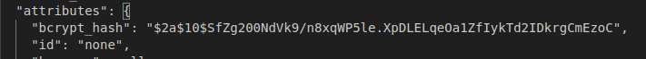

[Задание](https://github.com/netology-code/ter-homeworks/blob/main/01/hw-01.md)

## Чек-лист
- `terraform --version`


- `git clone git@github.com:netology-code/ter-homeworks.git`


- `docker --version'  
'docker compose version'  


## Задание 1
### 1. Перейдите в каталог src. Скачайте все необходимые зависимости, использованные в проекте.  

- `terraform init`  

Несовместимая с условием версия. Не хочется ставить глобально более старую версию, поэтому ставим `tfenv`:  
`git clone https://github.com/tfutils/tfenv.git ~/.tfenv`  
`echo 'export PATH="$HOME/.tfenv/bin:$PATH"' >> ~/.bash_profile`  
`source ~/.bash_profile`  


- Ставим нужную версию и делаем её активной:  
`tfenv install 1.8.4`  
`tfenv use 1.8.4`  
  

- Инициализируем `terraform init`:


### 2. Изучите файл .gitignore. В каком terraform-файле, согласно этому .gitignore, допустимо сохранить личную, секретную информацию?(логины,пароли,ключи,токены итд)

Секретная информация должна храниться в файле `personal.auto.tfvars`.

### 3. Выполните код проекта. Найдите в state-файле секретное содержимое созданного ресурса random_password, пришлите в качестве ответа конкретный ключ и его значение.

- `terraform apply`  


- Ищем секретное содержимое, пароль:  
  
также потенциально опасным является утечка hash:  


- Ключ -> значение:  
```
"result": "0k8WGIBPgsTjp95a"

"bcrypt_hash": "$2a$10$SfZg200NdVk9/n8xqWP5le.XpDLELqeOa1ZfIykTd2IDkrgCmEzoC"
```

### Раскомментируйте блок кода, примерно расположенный на строчках 29–42 файла main.tf. Выполните команду terraform validate. Объясните, в чём заключаются намеренно допущенные ошибки. Исправьте их.

- `terraform validate`  


Ошибки:
1. Не указано имя ресурса. Строку:  
`resource "docker_image" {`  
меняем на  
`resource "docker_image" "nginx_image" {`  

2. Имя ресурса не может начинаться с цифры. Строку:  
`resource "docker_container" "1nginx" {`  
меняем на  
`resource "docker_container" "nginx_container" {`

3. Здесь видно намеренно допущенные ошибки, строку:  
`name  = "example_${random_password.random_string_FAKE.resulT}"`  
меняем на  
`name  = "example_${random_password.random_string.result}"`

4. Для лучшего понимания меняем имя `nginx` на `nginx_image`, чтобы было очевидно, что это image, а не контейнер:
`image = docker_image.nginx.image_id`  
меняем на  
`image = docker_image.nginx_image.image_id`  


### 5. Выполните код.
Исправленный фрагмент:  
```terraform
resource "docker_image" "nginx_image" {
  name         = "nginx:latest"
  keep_locally = true
}

resource "docker_container" "nginx_container" {
  image = docker_image.nginx_image.image_id
  name  = "example_${random_password.random_string.result}"

  ports {
    internal = 80
    external = 9090
  }
}
```

Запускаем `terraform apply`, проверяем `docker ps`:


### 6. Замените имя docker-контейнера в блоке кода на hello_world.


Опасность применения ключа -auto-approve:  
В случае ошибки будут внесены изменения без предупреждения, что может повлечь потерю данных, прерыванию критических процессов.  
Ключ может пригодиться при автоматизации (CI/CD) или в скриптах, где отсутствует пользовательское вмешательство.

### 7. Уничтожьте созданные ресурсы. 
`terraform destroy`  
`terraform.tfstate`:    
```
{
  "version": 4,
  "terraform_version": "1.8.4",
  "serial": 13,
  "lineage": "b92e0691-4970-bb78-e9e1-1ff36b71a8c8",
  "outputs": {},
  "resources": [],
  "check_results": null
}

```

### 8. Объясните, почему при этом не был удалён docker-образ nginx:latest.
Образ не уничтожен, т.к. ключ `keep_locally = true`

[Источник](https://docs.comcloud.xyz/providers/kreuzwerker/docker/latest/docs/resources/image)

## Задание 2

### 1. Создайте в облаке ВМ.

- Создаём [main.tf](src/create_yandex_vm/main.tf) для создания ВМ.
- Критичные данные помещаем в `personal.auto.tfvars` и прописываем это имя в [gitignore](.gitignore)
- Создаём вм `terraform apply`  
- Проверяем создание вм:  


### 2 Подключитесь к ВМ по ssh и установите стек docker.
#### Вариант 1 (вручную)
- Подключаемся:  
`ssh ubuntu@51.250.91.130`
- Ставим Docker:  
`curl -fsSL get.docker.com -o get-docker.sh && chmod +x get-docker.sh && ./get-docker.sh`
#### Вариант 2 (с ansible)
- Берём [ansible playbook](src/ansible/playbook.yaml) из прошлой домашней работы, в [hosts](src/ansible/hosts)  указываем наш IP
- Запускаем  
`ansible-playbook -i hosts --private-key ~/.ssh/id_ed25519.pub playbook.yaml`
  
- Проверяем:  
```bash
ssh ubuntu@51.250.91.130
docker --version
docker compose version
```  

### 3. Найдите в документации docker provider способ настроить подключение terraform на вашей рабочей станции к remote docker context вашей ВМ через ssh.
- Находим в документации:
  
[Источник](https://registry.terraform.io/providers/kreuzwerker/docker/latest/docs#remote-hosts)  
- Создаём docker context:  
`docker context create yandex_vm_ubuntu --docker "host=ssh://ubuntu@51.250.91.130"
`
### 4. Используя terraform и remote docker context, скачайте и запустите на вашей ВМ контейнер mysql:8 на порту 127.0.0.1:3306.

- Пишем [main.tf](src/tf_docker/main.tf) для установки контейнера с mysql.
- Запускаем:  
`terraform apply`
- Смотрим `terraform.tfstate:`  

- Проверяем `docker ps`:  

### 6. Зайдите на вашу ВМ , подключитесь к контейнеру и проверьте наличие секретных env-переменных с помощью команды env. Запишите ваш финальный код в репозиторий.

[Финальный код main.tf](src/tf_docker/main.tf)

## Задание 3
### 1. Установите opentofu

### 2. Попробуйте выполнить тот же код с помощью tofu apply, а не terraform apply.
- С Nginx проблема в версии docker провайдера. Делаем копию и комментим строку:  
`required_version = "~>1.8.4"`
[main.tf](src/tofu/nginx/main.tf)
- Запускаем `tofu init`, `tofu apply`  
Сработало:  

- Делаем копию в [tofu/yandex_vm](src/tofu/yandex_vm) и запускаем создание виртуальной машины. Для видимости разницы с terraform меняем имя ВМ на tofu1
- Проверяем наличие ВМ:  

- Меняем host в ansible и запускаем  
`ansible-playbook -i hosts --private-key ~/.ssh/id_ed25519.pub playbook.yaml`  

- Делаем копию и меняем ip на текущий: [main.tf](src/tofu/docker/main.tf)
- Запускаем `tofu init` и `tofu apply`
- Проверяем env в контейнере:  
`ssh ubuntu@89.169.157.16`  
`docker exec -it mysql_resource env`

- Выполняем `tofu destroy` сначала в [src/tofu/docker](src/tofu/docker/), затем в [src/tofu/yandex_vm](src/tofu/yandex_vm/)
